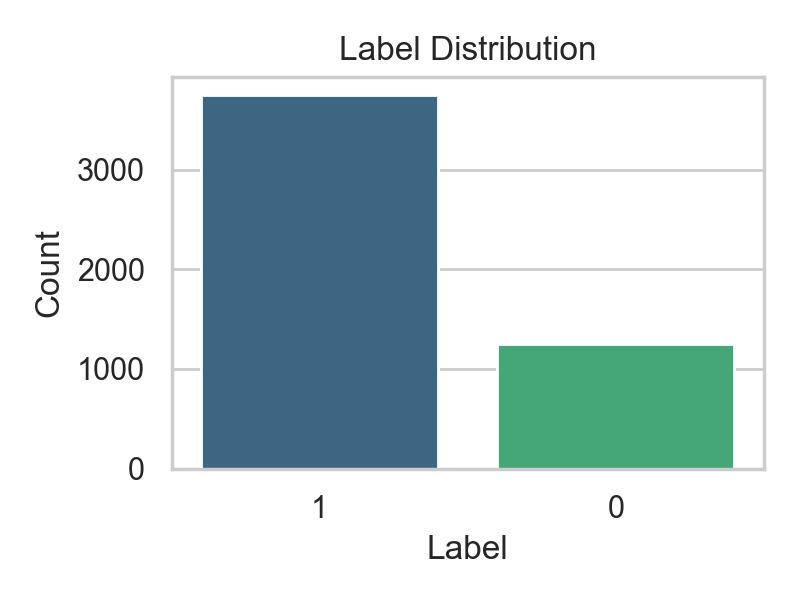
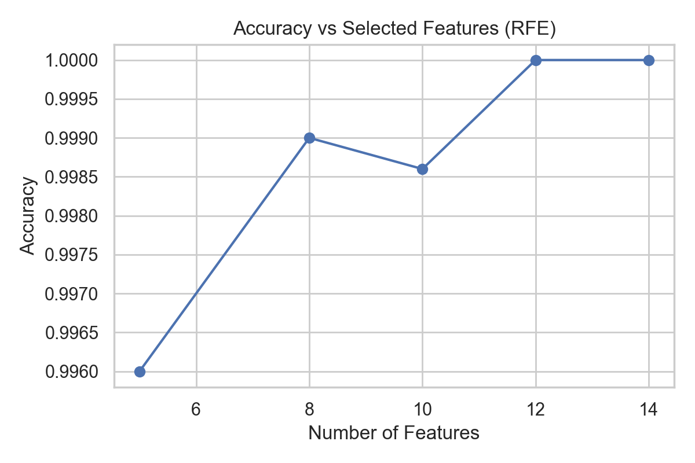
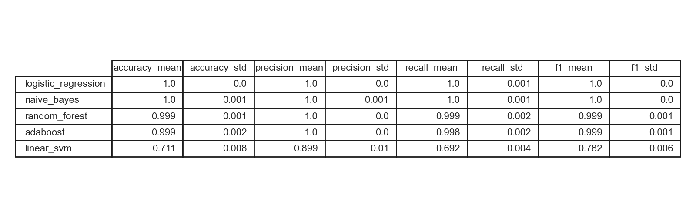
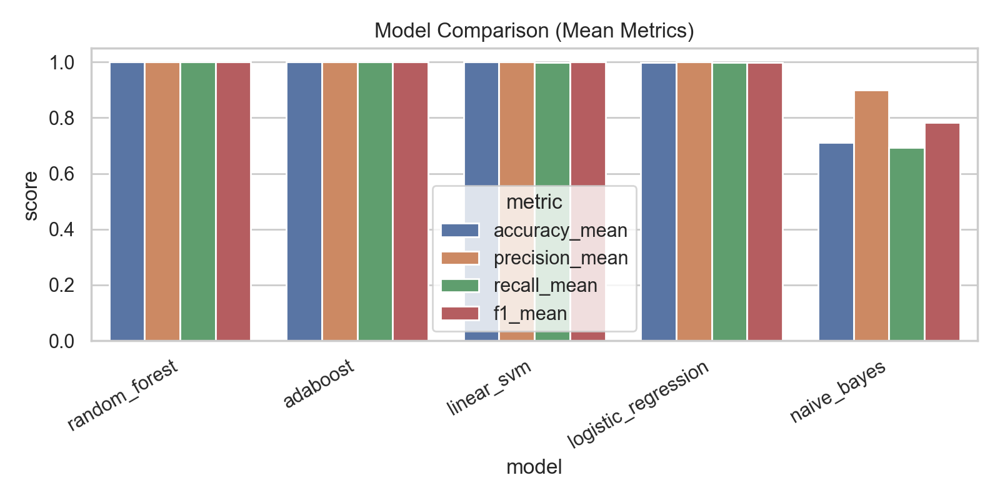
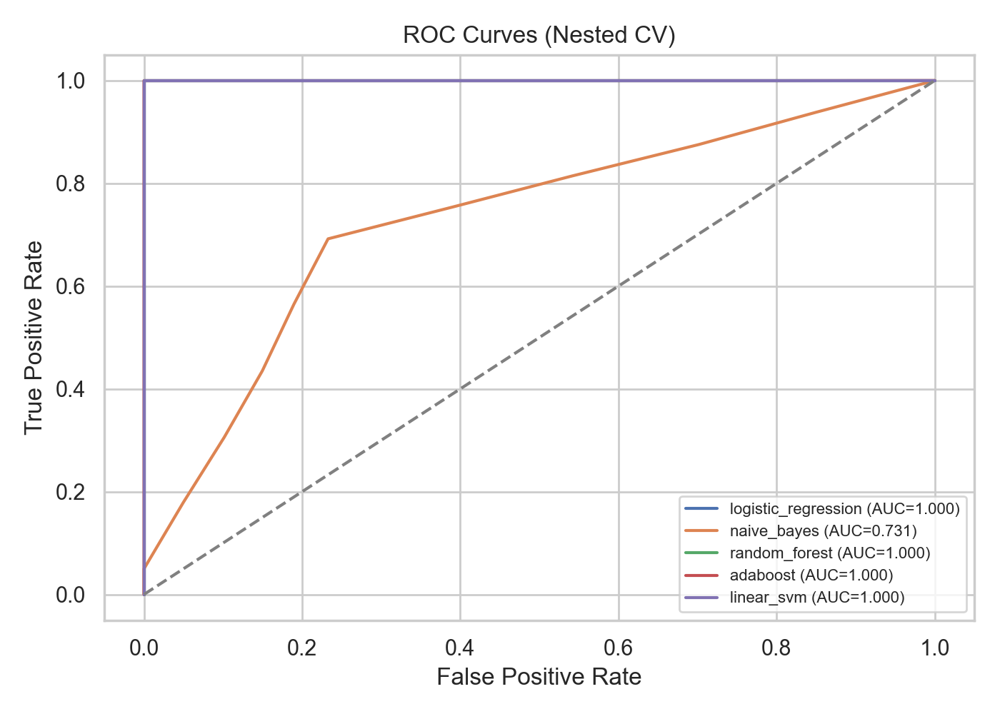
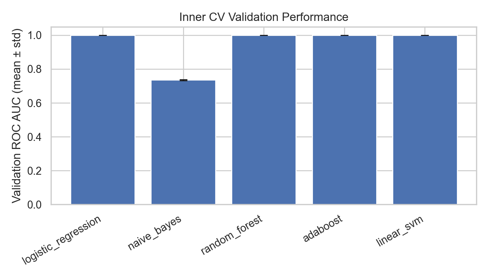

# IoT Traffic Anomaly Detection Reproduction

This repository reproduces the workflow from "IoT Dataset Validation Using Machine Learning Techniques for Traffic Anomaly Detection" (Vigoya et al., Electronics 2021). It mirrors the paper’s preprocessing (cyclical time encoding, binning, one‑hot encoding, flow aggregation), SMOTE within nested stratified 5‑fold CV, RFE feature selection, and evaluation of shallow ML models with ROC AUC tuning and Accuracy/Precision/Recall/F1 reporting.

## What’s inside

- `iot_anomaly_detection/`: Core ML package (data loading, preprocessing, model registry, nested CV training).
- `notebooks/experiment_reproduction.ipynb`: Step‑by‑step reproduction notebook with plots and leaderboard.
- `iot-anomaly-ui/`: React + FastAPI web UI (dataset upload/mapping, training, results, threat intel).
- `config/params.yaml`: Preprocessing and model grid defaults.
- `Dockerfile` + `docker-compose.yml`: Local deployment.

## Datasets (Hugging Face)

Supported proxy datasets used in the UI catalog and notebook:
- `fenar/iot-security`
- `schooly/Cyber-Security-Breaches`
- `stu8king/securityincidents`
- `kutay1907/scadaphotodataset`
- `kutay1907/ScadaData100k`
- `vossmoos/vestasv52-scada-windturbine-granada`

The mapper simulates missing DAD fields when needed (ports, protocol, timestamps). SCADA/incident datasets are converted into binary labels using domain-informed heuristics when labels are missing.

## Screen Recording

- Screen share video: [screensharing/0C506A0B-867E-4D30-83CF-40BA1A8AB26D.mov](screensharing/0C506A0B-867E-4D30-83CF-40BA1A8AB26D.mov)

## Quickstart (Notebook)

```bash
python3 -m venv .venv
source .venv/bin/activate
pip install -r requirements.txt
jupyter notebook
```

Open `notebooks/experiment_reproduction.ipynb` and run top to bottom. Charts are saved to `notebooks/outputs/`:
- `label_distribution.png`
- `accuracy_vs_features.png`
- `leaderboard_table.png`
- `model_comparison.png`
- `roc_curves.png`
- `validation_auc.png`

## Notebook Results (Figures)


Class balance after feature mapping and label derivation. This illustrates the imbalance that SMOTE addresses inside nested CV.


Accuracy as a function of RFE-selected feature count, mirroring the feature selection analysis in the paper.


Mean and standard deviation for Accuracy, Precision, Recall, and F1 across outer folds (single dataset run).


Side-by-side comparison showing tree-based models outperforming linear baselines in this run.


ROC curves aggregated across outer CV folds for the five core models.


Inner-CV ROC AUC stability across folds for each model.

## Multi-Dataset Results (sample_size=2000)

These results are from running the nested CV pipeline on three proxy datasets. Full table stored in `notebooks/outputs/leaderboard_multi.csv`.

| Dataset | Model | Accuracy | Precision | Recall | F1 |
|---|---|---:|---:|---:|---:|
| fenar/iot-security | random_forest | 1.0000 | 1.0000 | 1.0000 | 1.0000 |
| fenar/iot-security | adaboost | 1.0000 | 1.0000 | 1.0000 | 1.0000 |
| fenar/iot-security | logistic_regression | 0.1005 | 0.1005 | 1.0000 | 0.1826 |
| fenar/iot-security | linear_svm | 0.1005 | 0.1005 | 1.0000 | 0.1826 |
| fenar/iot-security | naive_bayes | 0.8995 | 0.0000 | 0.0000 | 0.0000 |
| schooly/Cyber-Security-Breaches | random_forest | 0.7147 | 0.5368 | 0.6979 | 0.5940 |
| schooly/Cyber-Security-Breaches | linear_svm | 0.5100 | 0.4100 | 0.7788 | 0.4144 |
| schooly/Cyber-Security-Breaches | naive_bayes | 0.5507 | 0.4156 | 0.6814 | 0.4126 |
| schooly/Cyber-Security-Breaches | logistic_regression | 0.5062 | 0.3727 | 0.7542 | 0.4070 |
| schooly/Cyber-Security-Breaches | adaboost | 0.6474 | 0.3760 | 0.4947 | 0.4032 |
| vossmoos/vestasv52-scada-windturbine-granada | random_forest | 1.0000 | 1.0000 | 1.0000 | 1.0000 |
| vossmoos/vestasv52-scada-windturbine-granada | adaboost | 1.0000 | 1.0000 | 1.0000 | 1.0000 |
| vossmoos/vestasv52-scada-windturbine-granada | logistic_regression | 0.9980 | 1.0000 | 0.9973 | 0.9986 |
| vossmoos/vestasv52-scada-windturbine-granada | linear_svm | 0.9945 | 1.0000 | 0.9926 | 0.9963 |
| vossmoos/vestasv52-scada-windturbine-granada | naive_bayes | 0.6980 | 0.8917 | 0.6752 | 0.7683 |

## Web UI

### Backend
```bash
cd iot-anomaly-ui/backend
PYTHONPATH=../.. python3 -m uvicorn main:app --reload
```

### Frontend
```bash
cd iot-anomaly-ui/frontend
npm install
npm run dev
```

### Docker Compose
```bash
docker-compose up --build
```

The UI includes:
- Dataset upload + mapping to core packet‑level attributes.
- Model configuration (LR, NB, RF, AdaBoost, Linear SVM + ExtraTrees, GradientBoosting).
- Training progress with nested CV and ROC AUC tuning.
- Results leaderboard with metrics, confusion matrices, feature importances.
- Threat‑intel assistant: CVE similarity + blue‑team response playbooks.

## UI Screenshots


Main control room summary showing dataset identity, columns, anomaly rate, and overall pipeline readiness.


Load a dataset from Hugging Face or upload a file, then map columns to the 14 core packet-level attributes.


Model selection and hyperparameter grid editor with RFE feature count and launch controls.


Risk score, severity, and CVE similarity matches for the active dataset.


Response playbook, defensive controls, blue-team tooling, and attack/defense scenarios.


Assistant chat grounded in dataset context, training status, and suggested prompts.


Step-by-step setup and pipeline walkthrough with quickstart commands.


Research summaries with how-it-works bullets and tutorial-style code sketches.


Dataset health panel showing label distribution, mapping coverage, and missingness hotspots with training status.

## Threat Intel & CVE Similarity

The backend computes TF‑IDF similarity against `ahadda5/cve150k` to surface relevant CVE themes. This is heuristic similarity (not a vulnerability scanner). Use it to guide triage and hypothesis generation.

## Reproducibility Notes

- Nested stratified CV with SMOTE and Decision Tree RFE matches the paper’s method.
- ROC AUC is used for inner‑CV tuning; Accuracy/Precision/Recall/F1 are reported on outer folds.
- If you need full‑scale runs, increase `sample_size` in the notebook config.

---

<div dir="rtl">

# بازتولید تشخیص ناهنجاری ترافیک IoT

این مخزن بازتولید کامل روش مقاله «IoT Dataset Validation Using Machine Learning Techniques for Traffic Anomaly Detection» (Vigoya و همکاران، ۲۰۲۱) است. در این پروژه تمام مراحل مقاله پیاده‌سازی شده‌اند: پیش‌پردازش داده (کدگذاری چرخه‌ای زمان، binning، one‑hot، تجمیع مبتنی بر جریان)، متعادل‌سازی کلاس‌ها با SMOTE در CV تو در تو، انتخاب ویژگی با RFE و درخت تصمیم، و ارزیابی مدل‌های کم‌عمق با ROC AUC و معیارهای Accuracy/Precision/Recall/F1.

## ساختار فنی پروژه

- `iot_anomaly_detection/`: بسته اصلی ML شامل بارگذاری داده، پیش‌پردازش، رجیستری مدل‌ها و CV تو در تو.
- `notebooks/experiment_reproduction.ipynb`: نوت‌بوک بازتولید مرحله به مرحله با نمودارها و جدول نتایج.
- `iot-anomaly-ui/`: داشبورد وب (FastAPI + React) برای آپلود داده، تنظیم مدل، آموزش، نتایج و تحلیل تهدید.
- `config/params.yaml`: پارامترها و گریدهای هایپرپارامتر.

## دیتاست‌ها (Hugging Face)

دیتاست‌های پشتیبانی‌شده شامل موارد زیر است:
- `fenar/iot-security`
- `schooly/Cyber-Security-Breaches`
- `stu8king/securityincidents`
- `kutay1907/scadaphotodataset`
- `kutay1907/ScadaData100k`
- `vossmoos/vestasv52-scada-windturbine-granada`

این دیتاست‌ها جایگزین DAD اصلی هستند. در صورت نبود ستون‌های ضروری، ستون‌های پایه شبیه‌سازی می‌شوند تا خط لوله قابل اجرا باشد.

## اجرای نوت‌بوک و تولید نمودارها

نوت‌بوک، نمودارها و جدول‌های مشابه مقاله را تولید می‌کند. خروجی‌ها در مسیر `notebooks/outputs/` ذخیره می‌شوند:
- توزیع برچسب‌ها
- دقت در برابر تعداد ویژگی‌ها
- جدول لیدربورد
- مقایسه مدل‌ها
- ROC Curves
- ROC AUC در CV داخلی

## داشبورد وب و تحلیل دفاعی

رابط کاربری وب یک داشبورد حرفه‌ای ارائه می‌دهد و امکان بارگذاری دیتاست، تنظیم مدل‌ها و آموزش را فراهم می‌کند. علاوه بر آن یک «دستیار بلو‑تیم» اضافه شده است که بر اساس داده‌ها سناریوهای حمله/دفاع و کنترل‌های پیشنهادی ارائه می‌دهد.

## تحلیل شباهت به CVE

بخش Threat Intel با محاسبه شباهت متنی (TF‑IDF) به دیتاست `ahadda5/cve150k`، موضوعات مشابه با CVEها را پیشنهاد می‌دهد. این قابلیت صرفا برای تحلیل اولیه است و جایگزین اسکن آسیب‌پذیری نیست.

## ارتباط با مقاله

تمام مراحل مقاله (پیش‌پردازش، SMOTE، RFE، CV تو در تو، ۵ مدل پایه و معیارهای ارزیابی) رعایت شده‌اند. نمودارها و جدول‌های خروجی نوت‌بوک مشابه نمودارهای مقاله هستند و برای گزارش علمی قابل استفاده‌اند.

</div>
